# System Architecture Documentation

## Overview

Autonomous Talent Partner is built on a modern, scalable microservices-inspired architecture with clear separation of concerns across frontend, backend, and data layers. The system supports real-time processing with WebSocket communication and integrates multiple AI services for intelligent hiring automation.

## Architecture Diagram

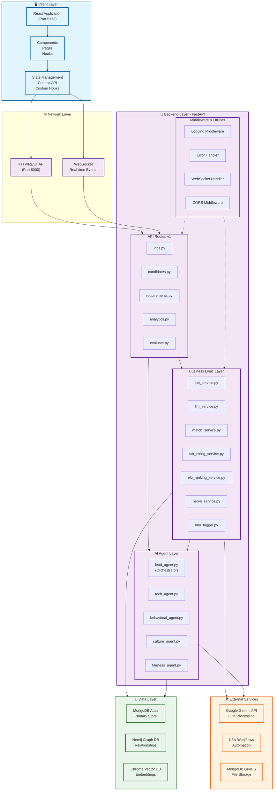

## Technology Stack

| Layer | Technology | Purpose |
|-------|-----------|---------|
| **Frontend** | React 18+, Vite | UI Framework & Build Tool |
| **Backend** | FastAPI, Python 3.8+ | API Server & Async Processing |
| **Databases** | MongoDB, Neo4j, Chroma | Data Storage & Retrieval |
| **AI/ML** | Google Gemini API | Language Model & Generation |
| **Real-time** | WebSocket (FastAPI) | Live Event Streaming |
| **Automation** | N8N | Workflow Orchestration |
| **File Storage** | MongoDB GridFS | Resume & Document Storage |

## Component Details

### 📱 Frontend Layer (React + Vite)

**Location:** `frontend/src/`

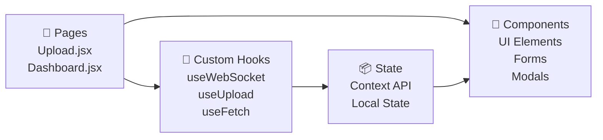

**Key Features:**
- **Upload.jsx**: Job posting and candidate management interface
- **Dashboard.jsx**: Analytics and statistics visualization
- **Real-time Updates**: WebSocket connection for live event streaming
- **Responsive Design**: Mobile-first with breakpoints at 768px, 1024px
- **UI Patterns**: Glassmorphism design, smooth animations

### 🔧 Backend Layer (FastAPI)

**Location:** `backend/app/`

#### API Routes (`app/api/v1/`)
| Module | Responsibility |
|--------|-----------------|
| `jobs.py` | Job CRUD, suggestions, finalization, publishing |
| `candidates.py` | Resume upload, candidate profile creation |
| `requirements.py` | Job requirement extraction & analysis |
| `analytics.py` | Dashboard metrics and statistics |
| `evaluate.py` | Candidate screening and evaluation |
| `websockets_api.py` | Real-time event streaming |

#### Business Logic (`app/services/`)
| Service | Purpose |
|---------|---------|
| `job_service.py` | Job lifecycle management |
| `llm_service.py` | Google Gemini API integration |
| `neo4j_service.py` | Graph database operations |
| `match_service.py` | Semantic similarity matching |
| `fair_hiring_service.py` | Bias detection & fairness checks |
| `elo_ranking_service.py` | Candidate quality ranking system |
| `db_service.py` | MongoDB operations |
| `n8n_trigger.py` | Workflow automation triggers |

#### AI Agents (`app/agents/`)
| Agent | Specialization |
|-------|----------------|
| `lead_agent.py` | Main orchestrator & decision maker |
| `tech_agent.py` | Technical skills evaluation |
| `behavioral_agent.py` | Soft skills & behavior assessment |
| `culture_agent.py` | Culture fit analysis |
| `fairness_agent.py` | Hiring bias detection |
| `code_quality_agent.py` | Code review (if applicable) |

### 💾 Data Layer

#### MongoDB (Primary Data Store)
```
Collections:
├── jobs               # Job postings with status, content, metadata
├── candidates         # Candidate profiles, assessments, scores
├── job_requirements   # Extracted skill requirements
├── activity_logs      # Audit trail and event history
└── feedback          # User feedback and ratings
```

#### Neo4j (Graph Database)
```
Nodes:
├── Job          # Job postings
├── Candidate    # Candidate profiles
├── Skill        # Technical and soft skills
├── Company      # Company information
└── Position     # Role descriptions

Relationships:
├── REQUIRES     # Job requires Skill
├── HAS_SKILL    # Candidate has Skill
├── MATCHES      # Job matches Candidate
└── WORKED_AT    # Candidate worked at Company
```

#### Chroma (Vector Database)
```
Indexes:
├── job_embeddings       # Semantic job descriptions
├── candidate_embeddings # Resume embeddings
└── skill_embeddings     # Skill vector space
```

## Data Flow Diagrams

### 📊 Job Lifecycle Flow

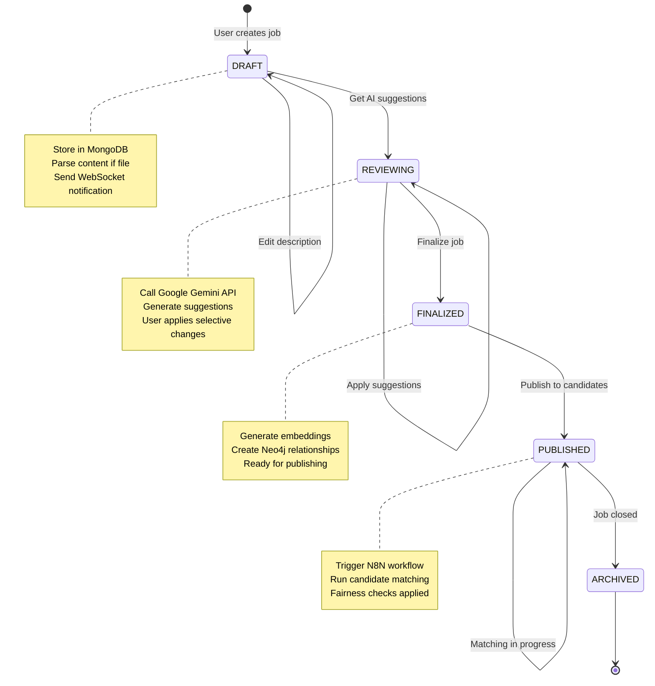

### 🤝 Candidate-Job Matching Flow

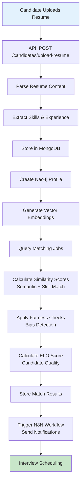

### ⚡ WebSocket Real-time Event Flow

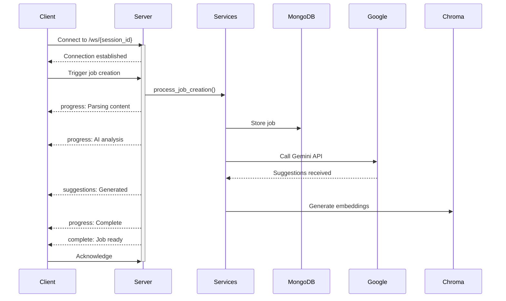

### 🔄 AI Suggestion Pipeline

```mermaid
graph LR
    A["Job Description"] --> B["Extract Key Info"]
    B --> C["Create Prompt"]
    C --> D["Google Gemini API"]
    D --> E["Generate Suggestions"]
    E --> F["Rank by Relevance"]
    F --> G["Return to Frontend"]
    G --> H["User Reviews"]
    H --> I["Apply Selected<br/>Suggestions"]
    I --> J["Update MongoDB"]
    J --> K["Updated Description<br/>Ready for Finalization"]
    
    style A fill:#fff3e0
    style K fill:#c8e6c9
```

### 🛡️ Fairness & Bias Detection

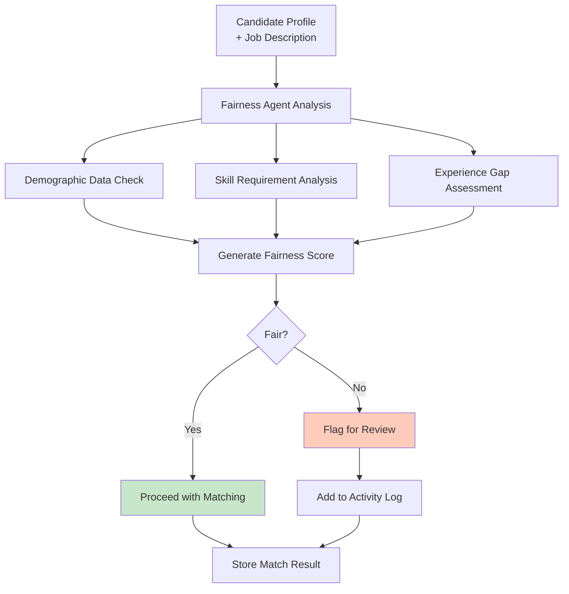

## Integration Architecture

### External Service Integrations

#### Google Gemini API
- **Purpose**: AI-powered content generation and analysis
- **Integration Points**: 
  - Job description suggestions
  - Resume content extraction
  - Skill requirement identification
  - Fairness and bias analysis
- **Error Handling**: Retry logic with exponential backoff, fallback responses

#### N8N Workflow Engine
- **Workflows**:
  - `interview_scheduler.json`: Schedules interviews based on matches
  - `candidate_acceptance_workflow.json`: Handles candidate acceptances
  - `candidate_rejection_workflow.json`: Processes rejections
- **Trigger**: `n8n_trigger.py` service calls N8N webhooks
- **Benefits**: Decoupled workflow management, scalable automation

#### MongoDB GridFS
- **Usage**: Store large resume files beyond BSON document limits (16MB)
- **Integration**: `storage_service.py` handles file operations
- **Features**: Automatic chunking, retrieval by file ID

### Database Integration Patterns

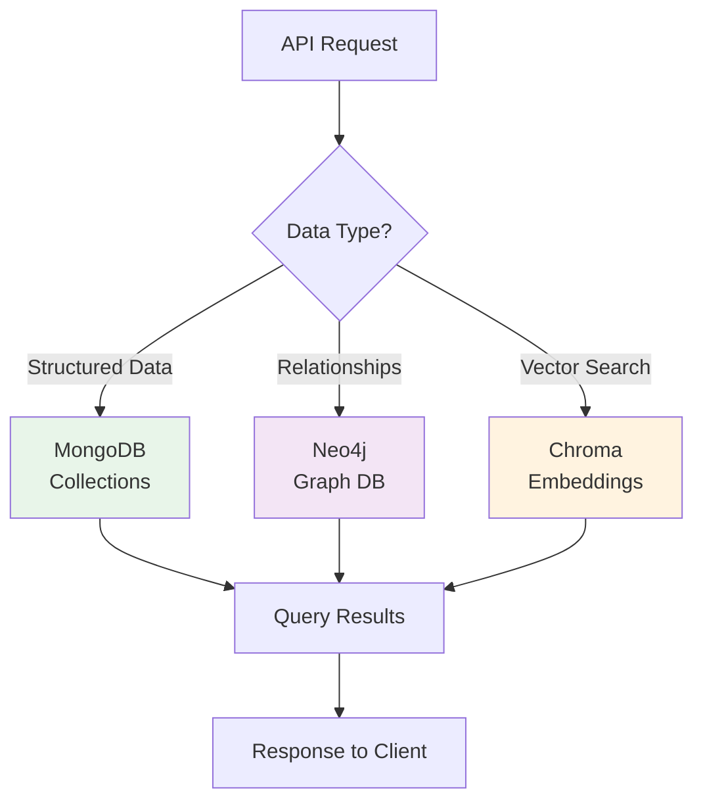

## Security Architecture

### Authentication & Authorization
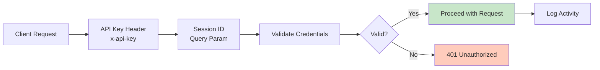

### Data Protection Measures
| Layer | Protection |
|-------|-----------|
| **Transport** | TLS/SSL encryption for all connections |
| **Database** | MongoDB authentication & role-based access |
| **Input** | Schema validation using Pydantic models |
| **CORS** | Whitelist specific origins, prevent cross-origin attacks |
| **Logging** | Audit trail for all operations in activity_logs collection |

### Audit & Compliance
- Request ID tracking for traceability
- Activity logging for all user actions
- Error context preservation for debugging
- User identification in logs

---

## Performance Optimization

### Caching Strategy
- **Connection Pooling**: 10-50 concurrent MongoDB connections
- **Query Optimization**: Indexed queries on frequently searched fields
- **Lazy Loading**: Load candidate/job details on demand

### Database Performance
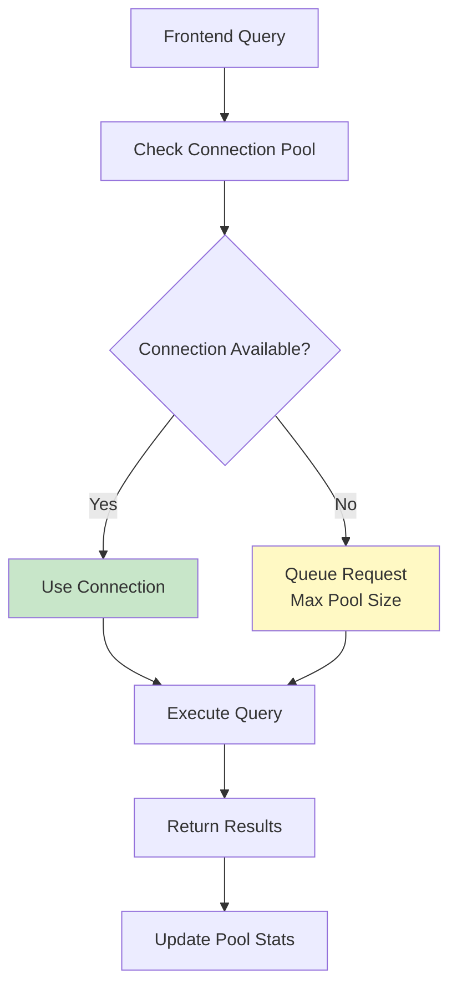

### Optimization Techniques
- Async/await for non-blocking I/O
- Batch processing for bulk operations
- Vector index optimization in Chroma
- MongoDB aggregation pipelines for complex queries

---

## Scalability Architecture

### Stateless Backend Design
- All state stored in databases, not in memory
- Multiple FastAPI instances can run independently
- Load balancer distributes requests across instances
- Session affinity required only for WebSocket connections

### Horizontal Scaling
```
┌─────────────────┐
│  Load Balancer  │
└────────┬────────┘
         │
    ┌────┼────┐
    │    │    │
    v    v    v
  ┌──┐ ┌──┐ ┌──┐
  │API│ │API│ │API│ (Stateless instances)
  └──┘ └──┘ └──┘
    │    │    │
    └────┼────┘
         │
    ┌────┴─────────────┐
    │                  │
    v                  v
  MongoDB           Neo4j
  (Primary)         (Graph)
    │                  │
    └────────┬─────────┘
             │
             v
          Chroma
         (Vector)
```

### Database Scaling
- **MongoDB**: Sharding by job_id for distribution
- **Neo4j**: Read replicas for query scaling
- **Chroma**: Vector index optimization

---

## Disaster Recovery & High Availability

### Backup Strategy
| Service | Backup Method | Frequency | Recovery |
|---------|---------------|-----------|----------|
| MongoDB | Atlas automated | Continuous | Point-in-time restore |
| Neo4j | Database snapshots | Daily | Restore from snapshot |
| Application Code | Git repository | Per commit | Deploy from version control |

### Failover Mechanisms
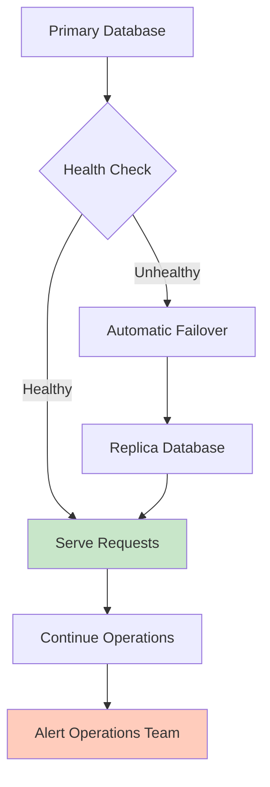

### Connection Resilience
- Automatic retry logic for failed connections
- Connection timeout handling
- Circuit breaker pattern for external APIs
- Graceful degradation for non-critical failures

---

## API Design Principles

### RESTful Endpoints
```
POST   /api/v1/jobs                      # Create job
GET    /api/v1/jobs                      # List jobs
GET    /api/v1/jobs/{job_id}             # Get specific job
PUT    /api/v1/jobs/edit/{job_id}        # Edit job
POST   /api/v1/jobs/suggestions/{job_id} # Get AI suggestions
POST   /api/v1/jobs/finalize/{job_id}    # Finalize job
POST   /api/v1/jobs/publish/{job_id}     # Publish job
DELETE /api/v1/jobs/{job_id}             # Delete job

POST   /api/v1/candidates/upload-resume  # Upload resume
GET    /api/v1/candidates                # List candidates
GET    /api/v1/candidates/match/{job_id} # Find matches
```

### Response Format
```json
{
  "status": "success|error",
  "data": { /* Response payload */ },
  "message": "Human readable message",
  "request_id": "unique-request-id-for-tracing"
}
```

---

## Monitoring & Observability

### Key Metrics to Track
- **API Performance**: Response times, error rates, throughput
- **Database**: Query performance, connection pool health
- **External APIs**: Latency, failure rates, quota usage
- **WebSocket**: Active connections, message throughput
- **Business**: Job creation rate, matching success rate, conversion

### Logging Strategy
```
Log Levels:
├── INFO    → User actions, successful operations
├── WARNING → Degraded performance, unexpected conditions
├── ERROR   → Operation failures, data issues
└── DEBUG   → Detailed execution flow (dev only)

Log Format:
{
  "timestamp": "ISO8601",
  "request_id": "uuid",
  "level": "INFO|WARN|ERROR",
  "service": "job_service",
  "message": "Job created successfully",
  "context": { /* Additional data */ }
}
```

---

## Deployment Architecture

### Development Environment
```
localhost:5173  (React Dev Server)
     ↓
localhost:8000  (FastAPI)
     ↓
MongoDB Atlas (Dev cluster)
```

### Production Environment
```
CDN (Static assets)
  ↓
Reverse Proxy (NGINX/Load Balancer)
  ↓
┌─────────────────────────────┐
│  Kubernetes Cluster (k8s)   │
│  ├── FastAPI Pods (3+)      │
│  ├── N8N Instance           │
│  └── Workers (async tasks)  │
└─────────────────────────────┘
  ↓
┌─────────────────────────────┐
│  Managed Databases          │
│  ├── MongoDB Atlas          │
│  ├── Neo4j Aura            │
│  └── Chroma Vector DB      │
└─────────────────────────────┘
```

---

## File Structure Reference

```
project-root/
├── frontend/
│   ├── src/
│   │   ├── components/       # Reusable UI components
│   │   ├── pages/           # Page-level components
│   │   ├── hooks/           # Custom React hooks
│   │   ├── api.js           # API client
│   │   └── context/         # Context providers
│   └── vite.config.js       # Build configuration
│
├── backend/
│   ├── app/
│   │   ├── api/v1/          # API routes
│   │   ├── services/        # Business logic
│   │   ├── agents/          # AI agents
│   │   ├── database/        # Data access
│   │   ├── core/            # Configuration
│   │   └── middleware/      # Request processing
│   ├── requirements.txt     # Python dependencies
│   └── main.py             # Entry point
│
├── n8nworkflow/            # N8N workflow definitions
├── docs/                   # Documentation
│   ├── ARCHITECTURE.md     # This file
│   ├── SETUP_GUIDE.md      # Installation guide
│   └── API_DOCUMENTATION.md# API reference
│
└── docker-compose.yml      # Local development setup
```

---

**Last Updated**: April 2026  
**Version**: 1.0  
**Maintainers**: Development Team
